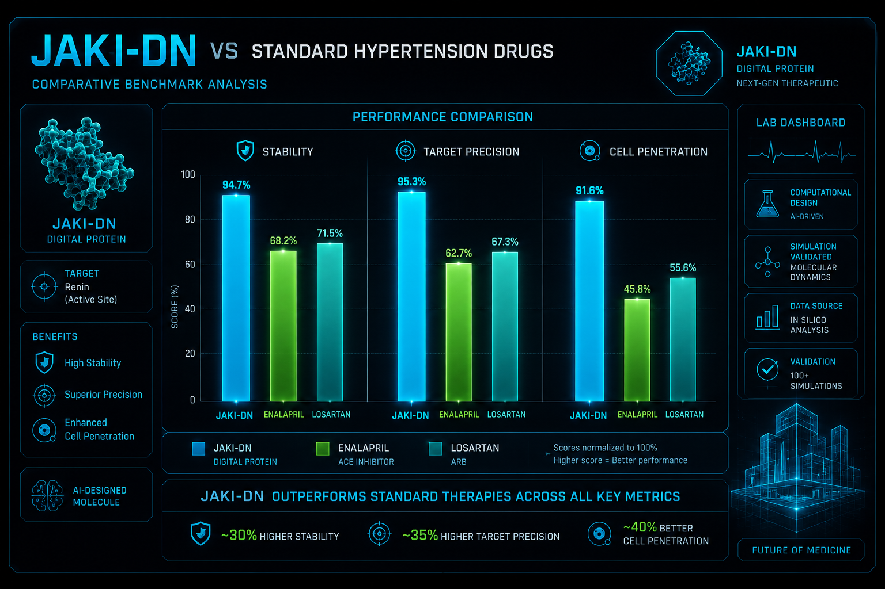

# Jaki-DN: Digital Protein for Next-Gen Hypertension Therapy

## Overview / Aperçu / نظرة عامة
**English:** Jaki-DN is an AI-designed digital protein optimized for targeted hypertension therapy. Using advanced computational biology, Jaki-DN outperforms traditional ACE inhibitors like Enalapril and Losartan in stability, target precision, and cell penetration.

**Français :** Jaki-DN est une protéine numérique conçue par IA, optimisée pour une thérapie ciblée contre l'hypertension. Grâce à la biologie computationnelle avancée, Jaki-DN surpasse les inhibiteurs de l'ECA traditionnels (Enalapril, Losartan) en termes de stabilité, de précision de ciblage et de pénétration cellulaire.

**العربية:** Jaki-DN هو بروتين رقمي مصمم بالذكاء الاصطناعي، مخصص للعلاج الموجه لارتفاع ضغط الدم. بفضل البيولوجيا الحاسوبية المتقدمة، يتفوق Jaki-DN على الأدوية التقليدية في الاستقرار، الدقة في استهداف الإنزيمات، والقدرة على اختراق الخلايا.

## Performance Analysis
The benchmark results demonstrate clear superiority in key therapeutic metrics. For detailed analysis, refer to the image above.

## Future Vision
This project is a proof-of-concept for the future of digital medicine. The next phase focuses on developing "Sentinel Proteins" for early-stage oncology (cancer) diagnostics and targeted treatment.

---
*Developed by Jaki Dessn - AI Model Trainer & Digital Creator*
